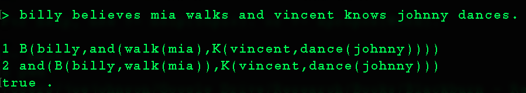
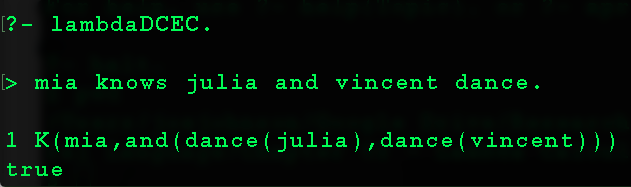
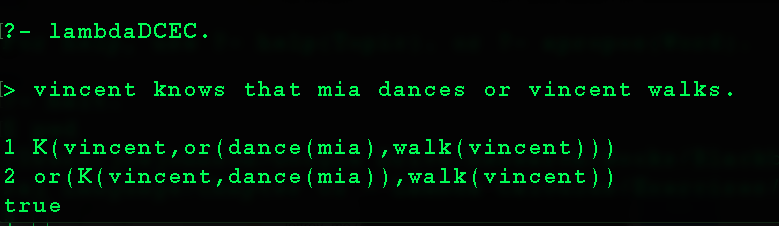
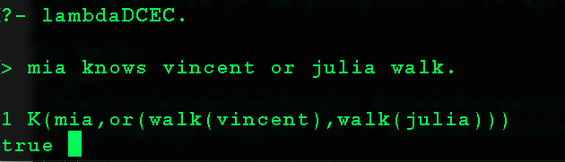
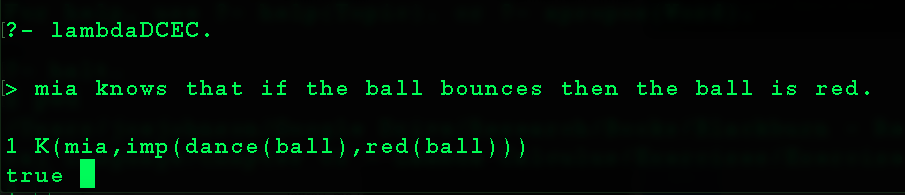
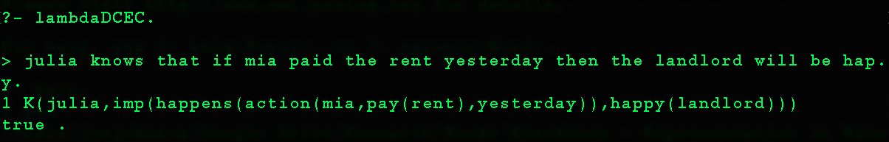
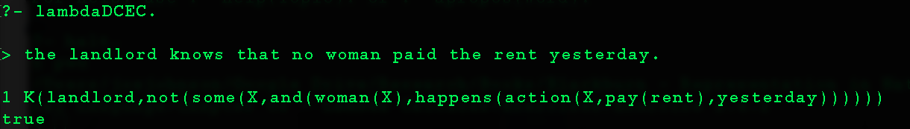

# DCEC Semantic Analyzer

## Description
This system, written in Prolog, programmatically generates, in the spirit of computational semantics, formal expressions in the language of the Deontic Cognitive Event Calculus (DCEC) from natural language sentences expressed in English.  A description of the DCEC can be found here:  http://kryten.mm.rpi.edu/PRICAI_w_sequentcalc_041709.pdf.  Whereas many computational semantic systems translate from natural language to First-Order Logic (FOL), this system targets the DCEC because of its greater expressivity with respect to the deontic, epistemic, doxastic, and tempooral dimensions.  As discussed in the paper whose link is given above, the DCEC offers the ability to model agents that must negotiate the behavior of other agents, by modeling their beliefs, knowledge, and intentions.  Providing a platform for programmatic translation of natural language sentences into this expressive representational language (i.e., the DCEC) promotes the prospect of automated reasoning from natural language descriptions of the problem domain.  Among other applications, this approach has applications in finer-grained question answer (QA), dialog representation theory, multi-agent systems, and more.

Acknowledgements are owed to Patrick Blackburn and Johan Ros whose textbook, Representation and Inference in Natural Language, (2006), CSLI Publications ISBN:  1575864967, inpired the lambda-calulus-based approach adopted in this system and provided supporting utility predicates including those for alpha and beta conversion of lambda calculus expressions generated from the grammar specified in this system.

## Instructions

1.  If you do not already have swi-prolog installed on your workstation, download prolog from here: http://www.swi-prolog.org/ and install it.
2.  Download this repository to your workstation.
3.  Navigate to the directory where this system was downloaded.
4.  Start swi-prolog by inputting the following at the bash prompt: $swipl\<Enter\>  
5.  At the prolog prompt, input the folloiwng to load the knowledge base for the system:  ?- [lambda_dcec].
6.  Follow the instructions as listed in the menu.
7.  Some example sentences are given below.  However, please use all lower case when inputting the names (unlike what is shown, below).

## Sample sentences

The DCEC semantic analyzer is still in its early stages of development.  However, below we show some sample sentences, and their DCEC representations as generated by the DCEC semantic analyzer system.  These should provide some insight into the goals of the system, and its expressiveness.  Reasoning from these representations is discussed in detail in the paper whose link is provided above.

1.  Alice sees that in the beginning, Bob places the cookie in the cabinet.

DCEC representation:  S(alice,happens(action(bob, place(cookie,cabinet)),beginning))

2.  Julia knows that Mia paid the rent yesterday.

DCEC representation:  K(julia,happens(action(mia,pay(rent),yesterday))

3.  Vincent knows that Billy knows that Vincent will sell the car tomorrow.

DCEC representation:  K(vincent,K(billy,happens(action(vincent,sell(car)),tomorrow)))

4.  Vincent believes that Billy will sell a car tomorrow.  (note the use of the indefinite article, a, in this sentence vs. the definite article, the, in sentence 3, and the handling of those different situations by the DCEC semantic analyzer.)

DCEC representation:  B(vincent,some(X,and(car(X),happens(action(billy,sell(X)),tomorrow))))

## Semantic representations of non-proper nouns

There are two semantic representations of each noun.  For example, for the noun, car, we have the semantic representation when the word, car, is used with a definite article (e.g., the (e.g., the car ...)) and one for when car is used with an indefinite article (a, every, etc., (e.g., a car ...)):

noun(lam(X,car(X)) --> [car]        %% semantic representation when used with an indefinite article

noun(lam(X,app(X,car))) ---> [car]       %% semantic rep when used with a definite article.

Effectively, the definite-article-semantic-representation takes the same approach as if the word car was a proper noun, referencing exactly one object int the problem domain.  So, the lambda calculus expression parallels that for a proper noun.

For a given sentence with the word car in it, then, Prolog will produce two lambda calculus expressions - one for each semantic representation of the word car.  However, depending on whether the original sentence uses a definite article or indefinite article with that word, one of those lambda calculus expressions will not successfully translate to a well-formed formula (wff) in the DCEC.  The Prolog code has been modified to detect which one is not well-formed, and throws that one out, leaving only the other (good) one.  This is a procedural solution to a theoretical problem, but it appears to work.  

On the down side, this means that each non-proper noun has two representations in the lexicon.  But one could argue there will be many words that have multiple "meanings", (and thus, semantic representations), and so we should get used to this idea.  Also, however, from a computational perspective, it means 2x the number of lambda calculus expressions are generated for each occurrence of a  non-proper noun in the sentence.  Thus, the computation of the lambda calculus expression is exponential in the number of nouns in the sentence, but most of the time there are no more than 6 or 7 nouns in a sentence. So from a practical perspective, this shouldn't be prohibitive.

## Treatment of transitive verbs

Consider the semantic representation for the verb, places:

tv(lam(X,lam(M,lam(Y,lam(W,app(M,lam(N,app(X,lam(Z,happens(action(Y,places(Z,N)),W)))))))))) --> [places].

Next, consider the following example expression as it relates to the semantic representation of the word, places (the trans. verb):

       In the beginning, Bob places the cookie in the cabinet.
       
Those sentence elements coming after the word, "places", must have a lam/variable expression at the beginning of the semantic representation with a subsequent substitution in an app/variable(lam/new variable complex) expression down the line in the representation.  For example, the noun phrase, "the cookie", succeeds the verb, places, in the sentence. The semantic representation for "the cookie" is mapped to the lam(X,\_) variable, where X appears in the following expression with app(X,lam(Z,\_).  This has the effect of placing the semantic representation for "the cookie" in place of the variable, Z.  Likewise, for the phrase, "in the cabinet", its semantic representation is mapped to the lam(M,\_) expression, where there is an app(M,lam(N,\_) expression therein.  This effectively places the semantic representation for "in the cabinet" in place of the variable, N.

On the other hand, for the noun phrase, bob, which \*precedes\* the verb, places, that element is mapped to the lam(Y,\_) expression and is substituted for the variable, Y.

## Treatment of conjunctions and logical operators

### Conjunction:

There are a number of ways a conjunction, such as and, might be used - but the two cases I've dealt with so far are the 'logical' and - (where we have a construction consisting of 'sentence 1 + and + sentence 2'), and then where we have a form of natural language and - 'noun phrase 1 + and + noun phrase 2', as we commonly see in english.

First, the logical and:

Example a:  Billy believes mia walks and vincent knows johnny dances.

Notice that there are 2 semantic representations here as the precise meaning of this sentence is ambiguous.  This highlights the need we'll have to assign probabilities to different representations based on prior experience, etc.

Next the noun phrase 1 + and + noun phrase 2

Example b:  mia knows julia and vincent dance.

### Disjunction: (same idea as conjunction)

Example a:  vincent knows that mia dances or vincent walks.

Example b:  mia knows vincent or julia walk.

### Conditional:

Example a:  mia knows that if the ball bounces then the ball is red.

Example b:  julia knows that if mia paid the rent yesterday then the landlord will be happy.

### Negation:  

This is a large topic since there are so many ways to express a negative in English.  We start with the word 'no':

Example:  the landlord knows that no woman paid the rent yesterday.

